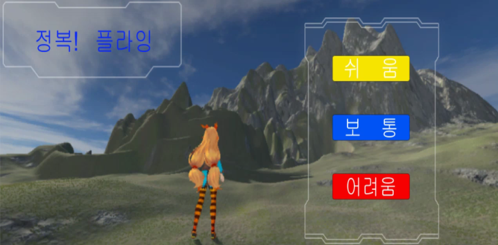
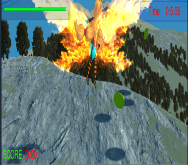
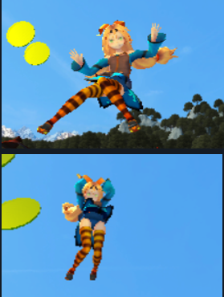
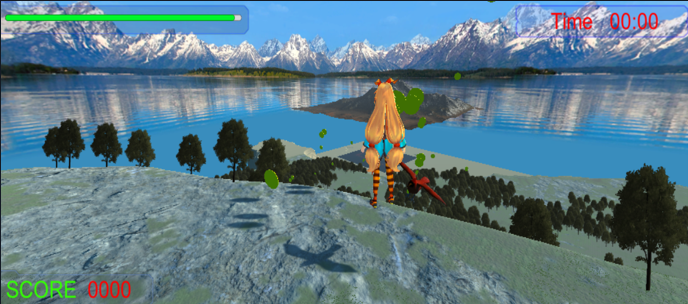
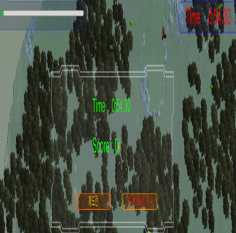
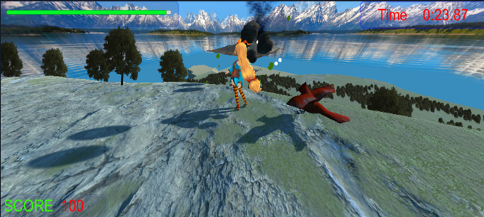

</img> 
# 정복! 플라잉

유니티를 통해 1인칭 3인칭 시점변환 3d 게임을 제작, 제한시간안에 닭 몬스터, 날아오는 운석을 피하고 최대한 많은 골드를 취득하여 골인지점 도착하기

***

# 개발 환경

* c#   

* 유니티 및 유니티에셋

***

# 기능소개

### `1. [ 메인화면]`   

 

### `2. [ 캐릭터 날아가는 모습]`    

 

### `3. [ 점프모션]`   

 

### `4. [ 게임 시작시 맵]`   
 
 

### `5. [ 시간초과 및 체력 0  ]`    
    
 

### `6. [ 닭 몬스터 및 화산재 날라오는 모습  ]`    
    
 

***

# 코드소개 

* [c# 부분 ](https://github.com/2jooho/unity_project_fly/tree/master/Assets/script, "c#")
